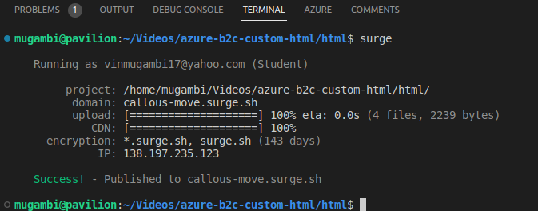
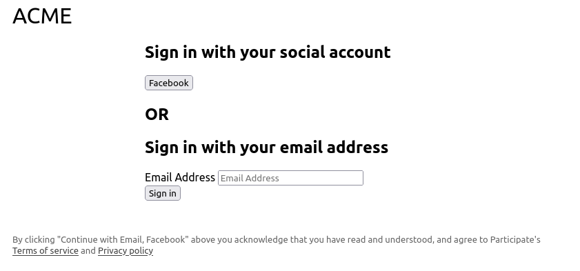
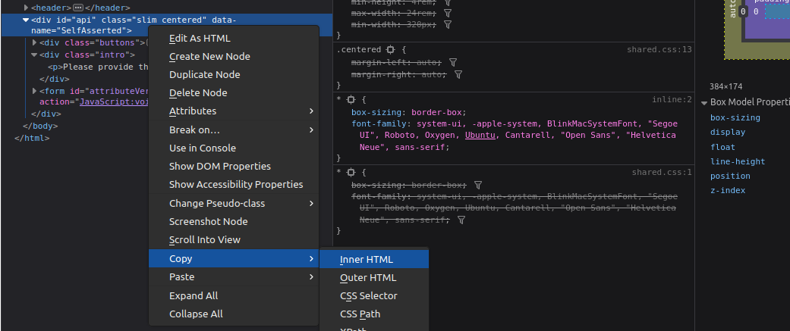
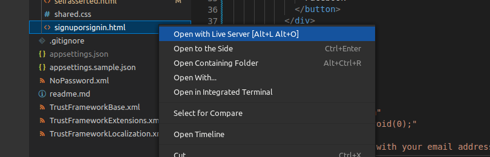

<notice>
Find the code for this tutorial at <a href="https://github.com/vinmugambi/azure-b2c-custom-html"> this GitHub repo </a>
</notice>

<notice>
 This articles assumes fundamental understanding of Azure AD B2C custom policies.
</notice>

User flows and custom policies allow you to determine how your customers interact with your app when they sign up, sign in, reset password and update profile. User flows are easy to set up and recommended for most users. However they limit UI customization options to only adding a brand logo, changing page background and choosing one among three layout templates. If you wan't more you'll have to reach for custom policies.

In this article I will show you how to alter the look and behaviour of a custom policy to fit your needs. I'll be customizing a password-less policy I made.

## Why customize

Login and sign up pages are among the first pages your customers interact with upon acquisition, it's important that you make them frictionless.

Here is how the local authentication journey looks now.

<div class="flex full-width px-8">
<figure class="mx-auto">
 <nuxt-img src="/initial.png"> </nuxt-img>
 <figcaption>UI states through the sign in with email journey</figcaption>
</figure>
</div>

Looking at the current journey, there are things that bother me:

- The multiple primary buttons in the verify email page - I know most of these buttons can be removed without affecting the operation of the policy.
- The general language of the pages - I don't like the what the headings, subheadings and buttons say and need them to align to our brand.
- The position and look of error messages.
- I want to provide a terms of service agreement from outside the custom policy to reduce the number of actions customers need to perform when signing up.

<div class="flex full-width px-8">
<figure class="mx-auto">
 <nuxt-img src="/styled.png"> </nuxt-img>
 <figcaption>Desired sign in with email journey</figcaption>
</figure>
</div>

### Prerequisites

- Visual Studio Code
- [Azure AD B2C extension for VS code](https://marketplace.visualstudio.com/items?itemName=AzureADB2CTools.aadb2c)
- Node.js (optional)
- Git (optional)

### Setup

To begin, download the unstyled sample policy from<a href="https://github.com/vinmugambi/azure-b2c-custom-html"> this GitHub repository</a> and switch to the `unstyled` branch. Then, follow the readme instructions add it to your Azure AD B2C tenant.

```
git clone git@github.com:vinmugambi/azure-b2c-custom-html.git
cd azure-b2c-custom-html
git checkout unstyled
```

## Adding custom HTML

It is important to understand this about custom policies:

- The files form a hierarchy chain. Elements defined in a file can be changed in a file lower in the hierarchy, a familiar oop concept, you only to reference it element with its id. The `TrustFrameworkBase.xml` afters almost anything you'll need to create a custom policy, so many times we'll be overriding properties defined here. Most things are described here.
- The file with the `RelayingParty` determines the journey. In most case's you'll define files for sign in journey, reset password, and update profile. in our case we only have one called `NoPassword.xml`. This is because our users don't need to set a password, hence cannot forget it. I also prefer to handle profile profile update within my application instead of delegating to AD B2C.

- The `TechnicalProfile`s determine what information you collect from your users and what you do with it. In our case only two of them matter when customizing the ui. The one with id `CollectEmail` and `VerifyEmail` as Id

The fist step of your `RelayingParty` default journey determines how what is displayed in the first step, in our case a login/signup page. Looking the `ContentDefinitionReferenceId` property, we are using the `api.signuporsignin`. The properties of this file are defined the `TrustFrameworkBase.xml` file. In the we have overridden this file in our `NoPassword.xml`. Editing the base file is not recommended, this is because you might be have more then one policy. It only reasonable that we

```xml
<OrchestrationStep Order="1" Type="CombinedSignInAndSignUp" ContentDefinitionReferenceId="api.signuporsignin">
    <ClaimsProviderSelections>
        <ClaimsProviderSelection ValidationClaimsExchangeId="EmailExchange" />
        <ClaimsProviderSelection TargetClaimsExchangeId="FacebookExchange" />
    </ClaimsProviderSelections>
    <ClaimsExchanges>
        <ClaimsExchange Id="EmailExchange" TechnicalProfileReferenceId="CollectEmail" />
    </ClaimsExchanges>
</OrchestrationStep>
```

```xml
<ContentDefinition Id="api.signuporsignin">
    <LoadUri>~/tenant/templates/AzureBlue/unified.cshtml</LoadUri>
</ContentDefinition>
```

## initial html

to provide your own html
azure Ad will inject the html in your api div and override anything you put there.

create a file named `html/shared.css` and copy this into it

```css
* {
  box-sizing: border-box;
  font-family: system-ui, -apple-system, BlinkMacSystemFont, "Segoe UI", Roboto,
    Oxygen, Ubuntu, Cantarell, "Open Sans", "Helvetica Neue", sans-serif;
}

h2 {
  font-size: 2rem;
  margin: 0.2rem 0;
  font-weight: 500;
}

.wide {
  max-width: 800px;
  min-width: 320px;
  width: 100%;
}

.slim {
  width: 100%;
  min-height: 4rem;
  max-width: 24rem;
  min-width: 320px;
}

.centered {
  margin-left: auto;
  margin-right: auto;
}

.text-muted {
  color: #666;
  font-size: small;
}

.text-muted a {
  color: #444;
}

figure#logo {
  margin: 1rem;
  font-size: 2rem;
}

main {
  display: flex;
  min-height: 70vh;
  justify-content: center;
  align-items: center;
  flex-direction: column;
}
```

create a file named `html/signuporsignin.html`
and paste this into it

```html
<!DOCTYPE html>
<html lang="en">
  <head>
    <meta charset="UTF-8" />
    <meta http-equiv="X-UA-Compatible" content="IE=edge" />
    <meta name="viewport" content="width=device-width, initial-scale=1.0" />
    <title>Acme</title>
    <link rel="stylesheet" href="./shared.css" />
  </head>
  <body>
    <header>
      <nav class="wide centered">
        <figure id="logo">ACME</figure>
      </nav>
    </header>

    <!-- Azure AD B2C will insert its html here, anything you put inside this div
   will be overridden -->
    <main>
      <svg
        xmlns="http://www.w3.org/2000/svg"
        viewBox="0 0 24 24"
        fill="#777"
        style="height: 3rem; width: 3rem; display: block; margin-bottom: 2rem;"
      >
        <path
          fill-rule="evenodd"
          d="M12 1.5a5.25 5.25 0 00-5.25 5.25v3a3 3 0 00-3 3v6.75a3 3 0 003 3h10.5a3 3 0 003-3v-6.75a3 3 0 00-3-3v-3c0-2.9-2.35-5.25-5.25-5.25zm3.75 8.25v-3a3.75 3.75 0 10-7.5 0v3h7.5z"
          clip-rule="evenodd"
        />
      </svg>

      <div id="api" class="slim">
        Azure AD B2C will insert its html here, anything you put inside this div
        will be overridden by azure content.
      </div>

      <section class="wide">
        <p class="text-muted" style="margin: 3rem 1rem">
          By clicking "Continue with Email, Facebook" above you acknowledge that
          you have read and understood, and agree to Participate's
          <a href="#">Terms of service</a> and
          <a href="#">Privacy policy</a>
        </p>
      </section>
    </main>
  </body>
</html>
```

create another file named `html/selfasserted.html` and paste this into it

```html
<!DOCTYPE html>
<html lang="en">
  <head>
    <meta charset="UTF-8" />
    <meta http-equiv="X-UA-Compatible" content="IE=edge" />
    <meta name="viewport" content="width=device-width, initial-scale=1.0" />
    <title>Acme</title>
    <link rel="stylesheet" href="./shared.css" />
  </head>
  <body>
    <header>
      <nav class="wide centered">
        <figure id="logo">ACME</figure>
      </nav>
    </header>

    <main>
      <div class="slim">
        <h2 style="font-size: 2rem; margin: .2rem 0">Verify your email</h2>
        <p style="margin-bottom: 2rem" id="instruction">
          we have sent an email to you
        </p>
        <p style="margin-top: 0.4rem">
          Please check your inbox and copy the code
        </p>
      </div>

      <div id="api" class="slim">
        Azure AD B2C will insert its html here, anything you put inside this div
        will be overridden by azure content.
      </div>
    </main>
  </body>
</html>
```

## host the files in a publicly available domain and enable cors

You can use any cloud static hosting solution you like including Azure blob storage, Google storage, e.tc.
I'll use [Surge.sh](https://surge.sh/help/getting-started-with-surge) for its simplicity.

 <notice>
 The following require that you have [Node.js](https://nodejs.org) installed. Npm comes bundled with Node.js
 </notice>

Open the terminal, make sure you are in the folder that contains your project.

Install surge globally

```bash
npm install -g surge
```

Navigate to the folder that contains your `html` files and create a `CORS` file

```bash
cd html && echo "*" > CORS
```

Run surge to initiate deployment and answer the cli prompts

```bash
surge
```

Surge will deploy your files to surge.sh and return their public url



Now that you have the public url, open the `html/signuporsignin.html` and change the css links to an absolute path. Do the same thing in `selfasserted.html`

```html
<title>Acme</title>
<link rel="stylesheet" href="https://callous-move.surge.sh/shared.css" />
```

deploy your changes to surge.

```bash
echo callous-move.surge.sh > CNAME && surge
```

The CNAME file helps surge remember your public domain, instead of creating a new one.

## regenerate your custom policy files

Copy this url into `appsettings.json`.

```json
{
  "PoliciesFolder": "",
  "EnvironmentsFolder": "dist",
  "Environments": [
    {
      "Name": "Development",
      "Production": false,
      "Tenant": "participateb2c",
      "PolicySettings": {
        "IdentityExperienceFrameworkAppId": "4ca6fc17-f6f5-4d91-b789-4e320e0b1a85",
        "ProxyIdentityExperienceFrameworkAppId": "de823b09-5e3b-46a4-9fe1-9f5ec3807197",
        "FacebookAppId": "8180550952015656",
        "signInTemplateUrl": "https://callous-move.surge.sh/signuporsignin.html",
        "verifyTemplateUrl": "https://callous-move.surge.sh/selfasserted.html"
      }
    }
  ]
}
```

Now, generate policy again based on the updates `appsettings.json`. To do this, click `ctrl+shift+p` to open VS code command pallet. Search for "B2C build all policies" and click it.
Upload the generated files, located in `dist/Development`, to AD B2C tenant using the azure portal and run the one called `B2C_1A_NO_PASSWORD`

Your login page should now look like this



Let's now discuss what happened. Azure AD will merge its html with your provided html. It checks for the block element with the id of "api" and inserts an unstyled login form there, replacing everything you put there. This gives you control of any markup outside the api div and also the location of the api div.

## how do you style the content inside div

First let's discuss where the elements provided azure ad come from. These elements are determined by two things;

- Your self asserted technical profile determines what input inputs and buttons are displayed.
- DataUri value in the content definition of you UI technical profile determines the elements classes, id and general markup
- The localized resources, found in `TrustFrameworkLocalization.xml` determine the text on information, headers, input labels, placeholder and buttons.

Since you don't want got through the process of generating and uploading and testing your custom html each times its best we develop the html from localhost from now.

to do this, go the browser developer tools and copy everything inside div id = "api"



and paste it into your "signuporsignin.html` api's div. Your api div should now look like this.

```html{}[signuporsignin.html]
<div id="api" class="slim">
  <div
    class="claims-provider-list-buttons social"
    aria-label="Sign in with your social account"
    role="form"
  >
    <!-- omitted intentionally -->
  </div>

  <div class="divider">
    <h2>OR</h2>
  </div>

  <form
    id="localAccountForm"
    action="JavaScript:void(0);"
    class="localAccount"
    aria-label="Sign in with your email address"
  >
  <!-- omitted intentionally -->
  </form>
</div>
```

Enter your email and click sign in to view the verify email page.
Copy the contents of the api div into your `selfasserted.html` to make it look like this.

```html{}[selfasserted.html]
<div id="api" class="slim">
  <div class="buttons"></div>
  <div class="intro">
    <p>Please provide the following details.</p>
  </div>
  <form id="attributeVerification" action="JavaScript:void(0);">
    <!-- omitted intentionally -->
  </form>
</div>
```

Doing this will help you know the structure of the html provided by AD B2C thus be able to style it or play with it, without needing to test your custom policies from the azure portal.

Now our local html pages exactly match the look of our authentication pages and we can now use the vs code live server to serve our html and update changes as we make them.

Right click the `html/signinorsignup.html` file from vs code's side bar and select "open with live server". This will serve and open the file in your default browser.



Now everything is set up for local development.

## Customizing the login page (signuporsignin.html)

To achieve what we wanted we will:

### Change the text on the buttons

You can do this using JavaScript but Microsoft recommends that you do this from the policy files and we'll do do jus that.
Open `TrustFrameworkLocalization.xml` and find `<LocalizedString>` elements with `stringId` as `button_signin` and `FacebookExchange`
Change them as follows

```xml
<LocalizedResources Id="api.signuporsignin.en">
  <LocalizedStrings>

    <LocalizedString ElementType="UxElement" StringId="button_signin">Continue with Email</LocalizedString>
    <!-- omitted so save space -->
    <LocalizedString ElementType="ClaimsProvider" StringId="FacebookExchange">Continue with Facebook</LocalizedString>
    <!-- omitted so save space -->
  </LocalizedStrings>
</LocalizedResources>

```

One more thing, Open `NoPassword.xml` and make sure the `<RelayingParty>` element contains this. This will allow us to add javascript to our html.

```xml
<UserJourneyBehaviors>
  <ScriptExecution>Allow</ScriptExecution>
</UserJourneyBehaviors>
```

Save the files and upload them to your b2c tenant using the Azure portal.
we should now make the same changes to our local `html/signuporsignin.html` for visual consistency

```html{}[signuporsignin.html]
<!-- omitted intentionally -->
<button
  class="accountButton firstButton claims-provider-selection"
  id="FacebookExchange"
  role="link"
  autofocus=""
>
  Continue with facebook
</button>
<!-- omitted intentionally -->
<button id="next" type="submit" form="localAccountForm">
  Continue with email
</button>
```

### Change the order of our login options and hide headings

It's weird that when use your own html, the login options no longer abide the way ordered them the first `OrchestrationStep`. To solve this styles after the opening `body` tag of your html.

```html{}[signuporsignin.html]
<body>
<style>
#api {
  display: flex;
  flex-direction: column;
}
#api > #localAccountForm {
  order: 1;
}
#api > .divider {
  order: 2;
}
#api > .claims-provider-list-buttons {
  order: 3;
}
.social .intro h2 {
  display: none;
}
.localAccount .intro h2 {
  display: none;
}
.divider h2 {
  visibility: hidden;
  height: 0;
  width: 0;
}
.divider {
  border-bottom: 1px solid #eee;
  height: 0;
  margin: 2rem 0;
}
</style>
<!-- omitted intentionally -->
</body>
```

### Change the look of the elements

Add these at the end the `shared.css` file

```css{}[shared.css]
* {
  box-sizing: border-box;
  font-family: system-ui, -apple-system, BlinkMacSystemFont, "Segoe UI", Roboto,
    Oxygen, Ubuntu, Cantarell, "Open Sans", "Helvetica Neue", sans-serif;
}

ul {
  list-style-type: none;
  list-style-position: outside;
  padding-left: 0;
  margin: 0;
}

.wide {
  max-width: 800px;
  min-width: 320px;
  width: 100%;
}

.slim {
  width: 100%;
  min-height: 4rem;
  max-width: 24rem;
  min-width: 320px;
}

.centered {
  margin-left: auto;
  margin-right: auto;
}

.text-muted {
  color: #666;
  font-size: small;
}

.text-muted a {
  color: #444;
}

figure#logo {
  margin: 1rem;
  font-size: 2rem;
}

main {
  display: flex;
  height: 80vh;
  justify-content: center;
  align-items: center;
  flex-direction: column;
}

input {
  display: block;
  width: 100%;
  padding: 16.5px 14px;
  font-size: 16px;
  border-radius: 4px;
  border: 1px solid rgba(0, 0, 0, 0.23);
  outline: 2px solid transparent;
}

input:focus,
input:active {
  border: 1px solid transparent;
  /* outline: 2px solid #007fff; */
  outline: 2px solid #000;
}

.entry-item {
  padding: 1rem 0 2rem;
  display: flex;
  flex-direction: column;
}

.entry-item label {
  order: 1;
}

.entry-item input {
  order: 2;
}

.entry-item .error {
  order: 3;
}

.entry-item .error p {
  color: crimson;
  text-transform: lowercase;
  font-size: small;
  order: 3;
  margin: 4px;
}

label {
  display: block;
  margin-bottom: 0.4rem;
  font-size: small;
}

button#next,
button#readOnlyEmail_ver_but_verify {
  background-color: black;
  color: white;
  border: 1px solid black;
}
button#next:hover,
button#readOnlyEmail_ver_but_verify:hover {
  background-color: #333;
}
button#next:active,
button#next:focus,
button#readOnlyEmail_ver_but_verify:active,
button#readOnlyEmail_ver_but_verify:focus {
  outline: 3px solid rgba(0, 0, 0, 0.23);
}

button {
  width: 100%;
  display: block;
  padding: 16.5px 14px;
  border: 1px solid transparent;
  text-transform: uppercase;
  border-radius: 4px;
  outline: none;
  cursor: pointer;
}
button:active,
button:focus {
  outline: 3px solid black;
}

button#FacebookExchange {
  background-image: url(https://participateb2c.b2clogin.com/static/tenant/templates/idp_logos/colored/facebook.svg);
  background-repeat: no-repeat;
  background-size: 28px 28px;
  background-position: top 40% left 2%;
}
```

Remember to readd a reference to this css file in your html

```html
<!-- omitted intentionally -->
<title>Acme</title>
<link rel="stylesheet" href="https://callous-move.surge.sh/shared.css" />
<link rel="stylesheet" href="./shared.css" />
<!-- omitted intentionally -->
```

### Autofocus on the email input when the page loads

We only changed the visual order of the html elements, that is why the "continue with facebook" button is still focussed.

To make our email input take focus, add this javascript just before the end of body

```html{}[signuporsignin.html]
<body>
<!-- omitted intentionally -->
<script>
  document.getElementById("email").focus();
</script>
</body>
```

## Customize the verify email page

This will be a bit interesting since we are changing both look and behaviour. There is a lot going on here, so i'll take longer steps and explain them briefly.

add the following styles after the opening `<body>` tag

```html{}[selfasserted.html]
<body>
  <style>
    /* hide unwanted elements */
    input#readOnlyEmail,
    label#readOnlyEmail_label,
    .error.itemLevel,
    .helpLink.tiny,
    .intro > p,
    #readOnlyEmail_intro,
    .verificationInfoText {
      display: none !important;
    }
    /* button container */
    .buttons.verify {
      display: flex;
      flex-direction: column;
    }
    /* resend button */
    button#readOnlyEmail_ver_but_resend {
      margin-top: 0.8rem;
      font-weight: 400;
      border: none;
      background: none;
      cursor: pointer;
      order: 1;
      text-align: left;
      text-transform: none;
      padding:0;
    }
    button#readOnlyEmail_ver_but_resend > strong {
      color: rgb(32, 32, 218);
    }
    button#readOnlyEmail_ver_but_resend > strong:hover {
      color: rgb(101, 92, 223);
    }
    button#readOnlyEmail_ver_but_resend:hover {
      color: black;
    }
    /* continue button */
    #readOnlyEmail_ver_but_verify {
      order: 2;
      margin-top: 0.8rem;
    }
    button#readonlyEmail_ver_but_verify:disabled {
      background-color: #999;
      cursor: wait;
    }
    /* hide original continue button */
    #continue {
      display: none;
    }
  </style>
  <!-- ommited intentionally -->
</body>
```

add this script before the closing `</body>` tag

```html{}[selfasserted.html]
<body>
  <!-- omitted intentionally -->
   <script>
      (() => {
        sendCodeAndHideResendButton();
        showVerifyInputAndButton();
        replaceContinueButtonWithVerify();
        attachIntroductionText();
      })();

      function replaceContinueButtonWithVerify() {
        let verifyButton = document.getElementById(
          "readOnlyEmail_ver_but_verify"
        );
        let continueButton = document.getElementById("continue");

        verifyButton.innerText = "Continue";
        verifyButton.setAttribute("style", "display: block");

        continueButton.setAttribute("style", "display: none");

        verifyButton.addEventListener("click", function () {
          clearError();
          verifyButton.innerText = "loading ...";
          verifyButton.setAttribute("disabled", true);

          let interval = setInterval(function () {
            if (hasSuccess()) {
              document.getElementById("continue").click();
              clearInterval(interval);
            }
            if (hasError()) {
              verifyButton.innerText = "continue";
              verifyButton.removeAttribute("disabled");
              clearInterval(interval);
            }
          }, 1000);
        });
      }

      function showVerifyInputAndButton() {
        let verifyInput = document.getElementById("readOnlyEmail_ver_input");
        let verifyInputLabel = document.getElementById(
          "readOnlyEmail_ver_input_label"
        );
        let verifyButton = document.getElementById(
          "readOnlyEmail_ver_but_verify"
        );

        verifyInput.setAttribute("style", "display: block");
        verifyInput.setAttribute("placeholder", "Paste the code here ...");
        verifyInput.focus();

        verifyInputLabel.setAttribute("style", "display: block");

        verifyButton.innerText = "Continue";
        verifyButton.setAttribute("style", "display: block");
      }

      function attachIntroductionText() {
        let email = document
          .getElementById("readOnlyEmail")
          .getAttribute("value");

        document.getElementById(
          "instruction"
        ).innerHTML = `We just sent a temporary verification code to <strong> ${email} </strong>`;
      }

      function sendCodeAndHideResendButton() {
        let sendButton = document.getElementById("readOnlyEmail_ver_but_send");
        sendButton.setAttribute("style", "display: none;");
        setTimeout(() => {
          sendButton.click();
        }, 0);
        hideResendButton();
      }

      function hideResendButton() {
        let resend = document.getElementById("readOnlyEmail_ver_but_resend");

        hide();
        let interval = setInterval(() => hide(), 1000);

        setTimeout(function () {
          clearInterval(interval);
          show();
        }, 30000);

        function hide() {
          resend.setAttribute("style", "visibility:hidden");
          resend.innerHTML = "Didn't get the code? <strong>Resend</strong>";
        }

        function show() {
          resend.setAttribute("style", "visibility:visible");
        }
      }

      function hasError() {
        return (
          document.querySelector(".verificationErrorText[aria-hidden=false]") &&
          true
        );
      }

      function clearError() {
        let withError = document.querySelector(
          ".verificationErrorText[aria-hidden=false]"
        );
        if (withError) {
          withError.setAttribute("aria-hidden", true);
        }
      }

      function hasSuccess() {
        let success = document.querySelector(
          ".verificationSuccessText[aria-hidden=false]"
        );

        if (success) {
          success.setAttribute("style", "display: none");
          return true;
        }

        return false;
      }
    </script>
</body>
```

## Test again

Detach the your local css from `html/signuporsignin.html` and `html/selfasserted.html`

```diff-html{}[signuporsignin.html]
  <title>Acme</title>
+ <link rel="stylesheet" href="https://callous-move.surge.sh/shared.css" />
- <link rel="stylesheet" href="./shared.css" />
```

Navigate to the folder containing the html files and run surge to deploy your files.

```bash
surge
```

Now go the azure portal to test your new authentication pages.

## Conclusion

> page bundle with jquery and handlebars. Bundle phobia guys, this might slow page load time.
> Poor development tools around it, No ay to debug them, Unfamiliar and complex api, xml so verbose, so many related concepts that one has to understand.
