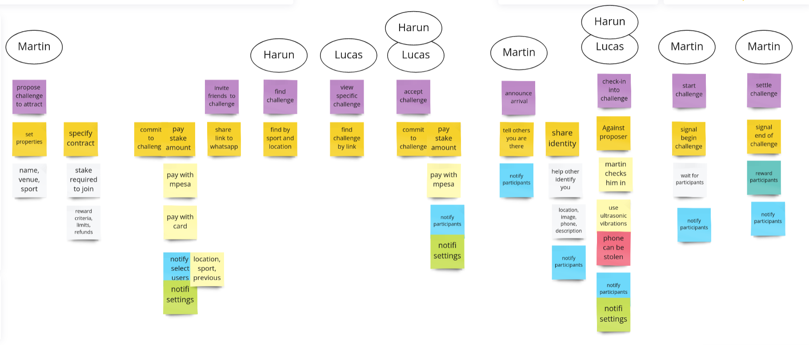
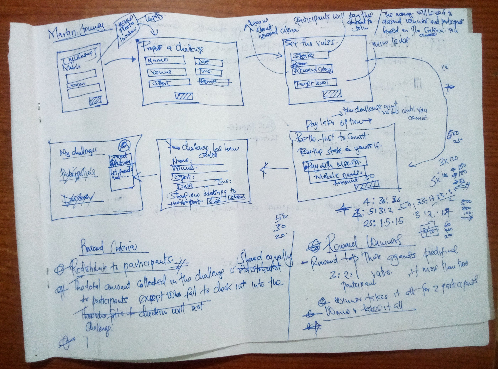
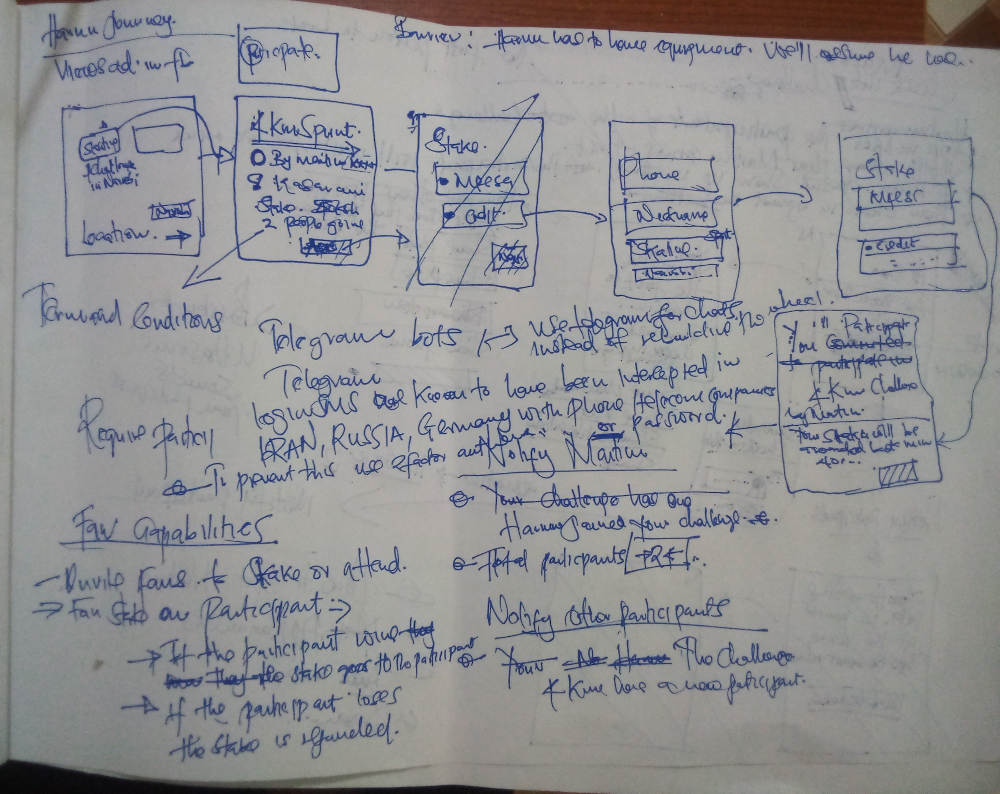
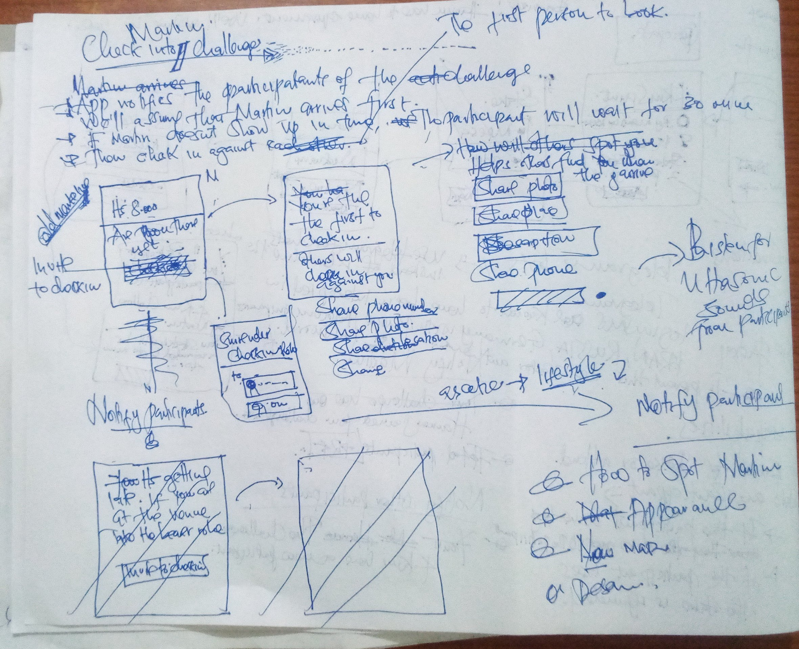
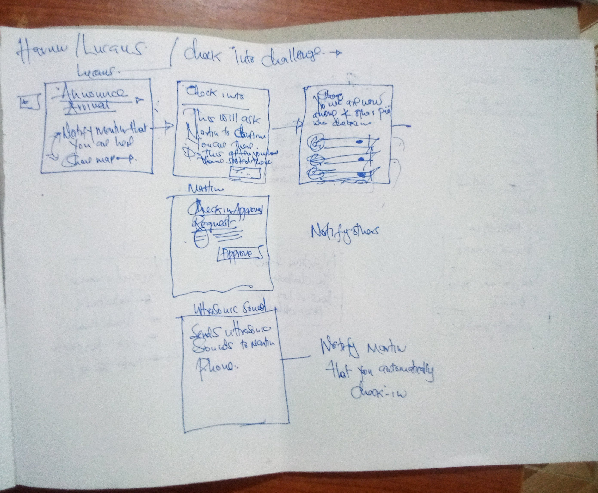
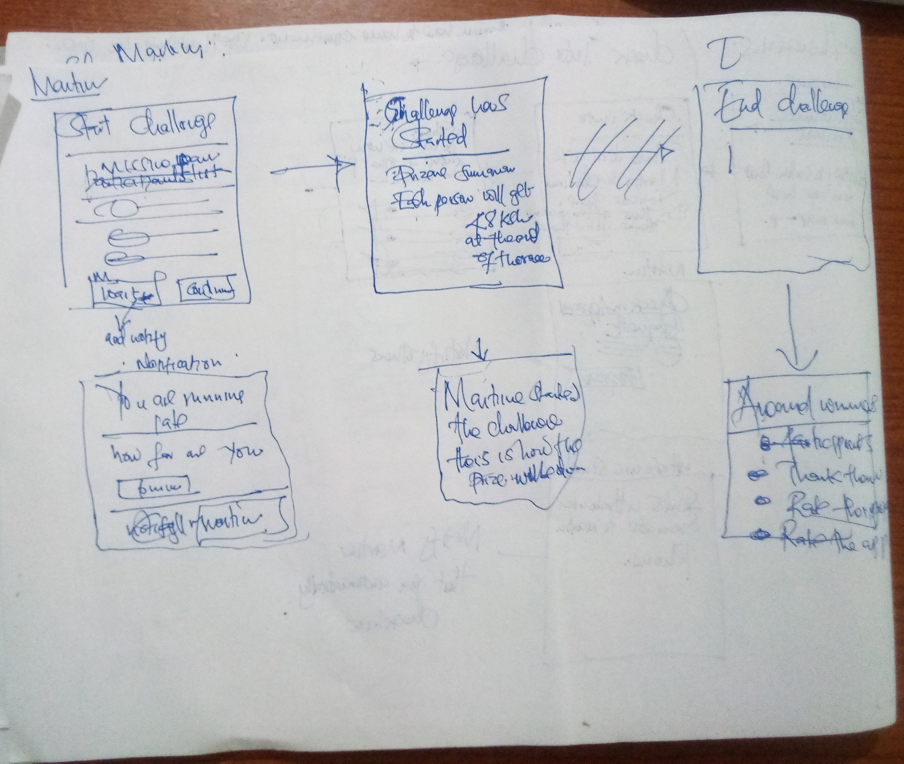
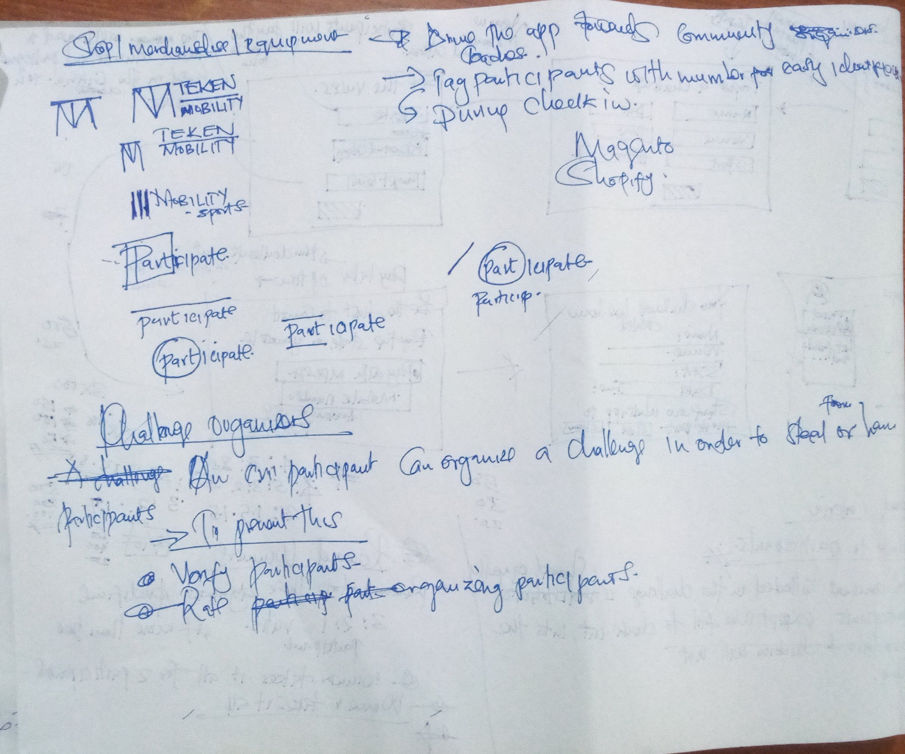

# Solution hypothesis

Use [personas](problem-hypothesis.md) as design targets - Focus on delighting this type of person, knowing that similar users will also be happy.

Link stories to [product goals](product-idea.md)

- [x] Solution journeys
- [x] UI sketches
- [x] Technical sketches
- [x] Metrics to measure success

## Solution Journeys

[](https://miro.com/app/board/uXjVOl8tQIA=/?moveToWidget=3458764529650863837&cot=10)

<div class="page"/>

## UI sketches








## Metrics to measure success

1. Challenges
2. Participations
3. Revenue

## Technical 
### Stack
1. Nuxt spa for web client
2. Nest for server

## Methodology
- use state machine for workflow coordination. store and retrieve state machine from memory/db
```js
function Machinery (machineDefinition) {

    return {
        function create(machineContext) {},
        function store (machineState) {},
        function retrieve(machineId) {}
    }
}
```
- create client and server concurrently.
- test 

### Domain
1. Payment
2. Customer
3. Challenges - main
4. Ledger
5. Marketing